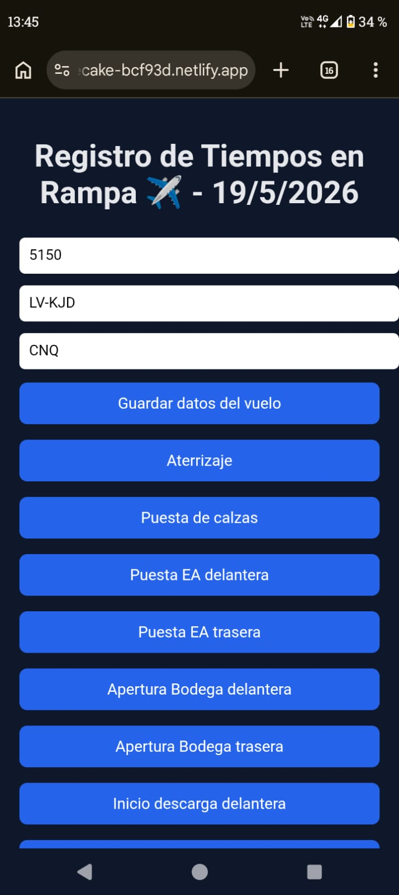
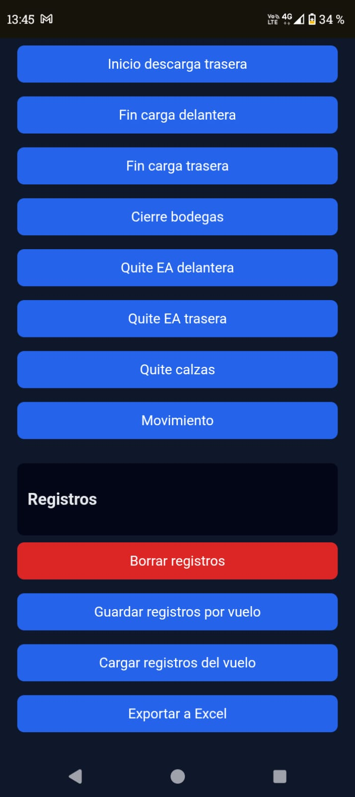

✈️ App desarrollada y utilizada en producción por el equipo de rampa
de Flybondi en la escala Corrientes (CNQ), Argentina.

# Registro de Tiempos de Rampa.

Progressive Web App para registrar tiempos operativos de rampa en operaciones aeroportuarias.

## Funcionalidades
- Registro de eventos con hora real
- Datos por vuelo (vuelo, matrícula, aeropuerto)
- Guardado por vuelo
- Exportación a Excel (CSV)
- Funciona offline (PWA)
- Instalable en celular

## Tecnologías
- HTML
- CSS
- JavaScript
- LocalStorage
- PWA

## Uso
1. Cargar datos del vuelo

## Autor

Franco Alejandro Gallegillo
Supervisor de Rampa — Flybondi Líneas Aéreas, Escala CNQ

[GitHub](https://github.com/DFrank-coder)

## Capturas

## Autor
Franco Alejandro Gallegillo
